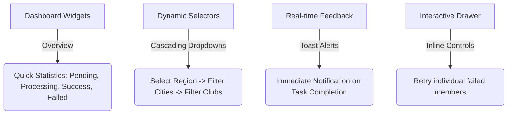

# Analysis & Recommendations: Improving the Freeze Module Project

This document provides a technical audit and roadmap for enhancing the Freeze Module project. The recommendations focus on UX improvements, validation correctness, celery execution reliability, and performance optimization.

---

## 1. Validation Logic Enhancements (Backend & API)

Currently, the backend has very basic validation (e.g., ensuring `start_date <= end_date`). However, several edge cases can bypass backend controls and lead to corrupt states:

### A. Overlap Freeze Validations
*   **Problem**: While the frontend Flatpickr calendar disables dates to prevent overlap, the backend `FreezeSerializer` and views do not perform date collision checks. An API request or manually entered form can bypass the UI and create overlapping freeze periods on the same subscription.
*   **Solution**: Implement a model/serializer-level validation check to ensure that for any target (region, city, club, or member), the proposed `start_date` and `end_date` do not overlap with any existing active freeze period on the affected subscriptions.
    ```python
    # Inside FreezeSerializer or Freeze.clean()
    def validate(self, attrs):
        start = attrs.get('start_date')
        end = attrs.get('end_date')
        # Check if any affected subscription already has an overlapping freeze period
        # overlapping_periods = SubscriptionFreezePeriod.objects.filter(
        #     member_subscription__in=target_subscriptions,
        #     start_date__lte=end,
        #     end_date__gte=start
        # )
        # if overlapping_periods.exists():
        #     raise serializers.ValidationError("This period overlaps with an existing freeze.")
    ```

### B. Validation of Freeze Duration vs. Subscription Validity
*   **Problem**: The system allows a freeze period to be created far in the future or exceeding realistic bounds (e.g., freezing a 30-day subscription for 10 years).
*   **Solution**:
    - Validate that the freeze `start_date` is not after the subscription's current end date.
    - Limit the maximum freeze length (e.g., maximum of 90 days per freeze, or a maximum total frozen days per subscription).

### C. Restrict Editing of Past/Active Freezes
*   **Problem**: Once a freeze Celery task has run and extended subscriptions, editing or deleting the `Freeze` model record will leave subscription dates inconsistent unless a rollback is triggered.
*   **Solution**: Make active or completed freeze records read-only in the admin panel and views. If a freeze must be revoked, implement an explicit "Unfreeze" workflow that subtracts the frozen days back from the subscriptions.

---

## 2. User Experience (UX) & Understandability

To make the application intuitive for club managers and admins:



### A. Cascading Target Selectors in Modals
*   **Improvement**: When adding a City, Club, or Member freeze, instead of showing massive dropdowns of all objects:
    - Implement cascading dropdown filters (e.g., selecting a Region automatically filters the City dropdown; selecting a City filters the Club list).
    - Use a search-as-you-type autocomplete input (e.g., Select2) instead of standard HTML dropdown lists for members.

### B. Inline Failure Actions inside Slide-Out Drawer
*   **Improvement**: Inside the "Affected Members" drawer, if a member freeze status is `Failed`, add a small **"Retry"** button next to that specific member row. This allows the admin to resolve individual issues (e.g., subscription expiry or plan mismatch) and trigger a single re-run without restarting the entire bulk job.

### C. Live Dashboard Overview Widgets
*   **Improvement**: Add small summary count cards at the top of freeze lists showing:
    - **Total Active Freezes** (Green indicator)
    - **Failed/Partially Failed Freezes** (Red indicator, with quick filters)
    - **Currently Executing Tasks** (Spinning loader badge)

### D. Toast Notifications for Background Tasks
*   **Improvement**: Integrate a client-side websocket (Django Channels) or brief toast manager. When an admin is navigating other pages and a Celery freeze finishes, display a top-right toast alert:
    - *“Success: Region A freeze completed. 1,200 members successfully updated.”*
    - *“Warning: Club B freeze finished with 4 errors. [View Details]”*

---

## 3. Performance & Scaling (Large Datasets)

Seeding 9,000+ members means a bulk freeze has to update thousands of database rows. We should ensure the application remains highly performant:

### A. Paginate Logs in the Detail Drawer
*   **Problem**: Rendering 9,000 member rows in a single HTML table inside the drawer causes high browser memory usage and sluggish UI rendering.
*   **Solution**: Implement backend-driven pagination (e.g. 50 entries per page) with a "Load More" button or standard pager inside the details drawer.

### B. Database Optimization & Indexing
*   **Improvement**: Ensure the following database columns have indexes to keep queries fast:
    - `MemberSubscription.status`
    - `SubscriptionFreezePeriod` (`start_date`, `end_date`)
    - `FreezeLog.status`
*   **Improvement**: Optimize the Celery loop in `process_bulk_freeze` to avoid individual `select_for_update` per iteration if possible, or process them in smaller database transaction chunks (e.g. batch size of 200) to keep SQLite locks short.
